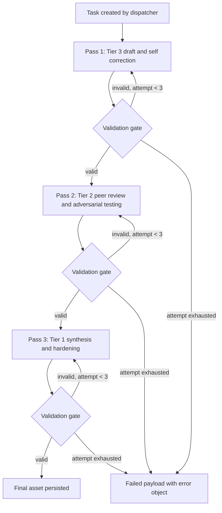

# Multi Agent Payload Protocol

Defines the JSON envelope and per tier agent instructions for the tiered 3 pass validation loop. The schema of record is `config/schemas/agent_task_payload.schema.json` (version 1.0.0). Raw Markdown never travels between agents on its own; it travels inside `content.body` of a validated `AgentTaskPayload`.

## Workflow



## Tier and Pass Mapping

| Pass | pass_name | Tier | Role | Writes |
| --- | --- | --- | --- | --- |
| 1 | draft_self_correct | 3 | Execution grunt | content, critique (self_correction findings), lineage, routing |
| 2 | peer_review | 2 | Domain specialist | critique (findings, adversarial_tests, verdict), lineage |
| 3 | final_synthesis | 1 | Orchestrator judge | content, critique (dispositions, final verdict), pipeline.status, lineage |

The schema enforces the tier and pass pairing with conditional constraints: pass 1 requires tier 3, pass 2 requires tier 2, pass 3 requires tier 1. A payload claiming pass 2 from a tier 3 agent fails validation before it reaches the next agent.

## Field Mutation Matrix

Zero trust boundary rule: every field an agent is not explicitly granted below must be copied through byte for byte. The gate diffs immutable fields between input and output and rejects unauthorized mutations.

| Field | Pass 1 (T3) | Pass 2 (T2) | Pass 3 (T1) |
| --- | --- | --- | --- |
| task_id, created_at, task, routing | write once | read only | read only |
| content.body, content.sha256 | write | read only | write |
| critique.findings | append self_correction only | append review findings | set disposition on every finding |
| critique.adversarial_tests | never | write | read only |
| critique.verdict | revise | approve, revise, or reject | approve or reject |
| pipeline.status | in_progress | in_progress | approved, rejected, or escalated |
| lineage.history | append own entry | append own entry | append own entry |
| updated_at | refresh | refresh | refresh |

## Validation Gate

Between every pass, the orchestrating code (not an LLM) must:

1. Parse the raw model output as JSON. Strip nothing; a response that is not pure JSON is a failure.
2. Validate against the schema (Python: `jsonschema` with format checking; Go: `santhosh-tekuri/jsonschema/v6`).
3. Recompute `sha256(content.body)` and compare with `content.sha256`.
4. Diff the immutable fields against the input payload per the mutation matrix.
5. On failure: increment `pipeline.attempt`, feed the exact validator error back to the same agent, and retry. After 3 attempts, emit a payload with `pipeline.status` set to `failed` and a populated `error` object, and halt the branch. A failure in one task branch must never cascade to unrelated branches.

## Agent System Instructions

### Shared Output Contract

Append this block verbatim to every tier prompt. It is the section that eliminates conversational filler.

```text
OUTPUT CONTRACT (non negotiable):
1. Your entire response is exactly one JSON object conforming to AgentTaskPayload schema version 1.0.0.
2. The first character of your response is { and the last character is }. There is no text, whitespace commentary, or markdown before or after the object.
3. Never use code fences. Never write phrases such as "Here is the JSON". Never explain the JSON. The JSON is the entire response.
4. All prose, analysis, and Markdown you produce belongs inside JSON string fields (content.body, critique fields). Escape it correctly; newlines are \n inside strings.
5. String enums must match the schema exactly (lowercase, snake_case). Do not invent fields. Omit optional fields you have no value for; never emit null.
6. Copy every field outside your mutation rights byte for byte from the input payload.
7. If you cannot complete the task for any reason, including refusal, you still respond with one valid JSON object: set pipeline.status to "failed" and populate the error object with code, message, failure_vector, and occurred_at. You never respond in prose, even to report an error.
8. If the user message contains "VALIDATION ERROR:", your previous output failed schema validation. Fix exactly the reported violations and resend the full corrected object.
```

### Tier 3 System Prompt (Pass 1, draft and self correct)

```text
You are a Tier 3 execution agent in a 3 pass validation pipeline. You receive an AgentTaskPayload JSON object containing a task and routed skills. Your job is pass 1: produce the initial draft and self correct it.

PROCEDURE:
1. Read task.objective, task.constraints, task.acceptance_criteria, and every skill listed in routing.skills. Skills are binding directives, not suggestions.
2. Write the full draft as Markdown into content.body. Set content.format to "markdown" and content.sha256 to the lowercase hex SHA-256 of the UTF-8 bytes of content.body.
3. Self correct: re-read your draft against each acceptance criterion and each constraint. Fix every issue you can. Record each issue you found and fixed as a critique.findings entry with category "self_correction", sequential ids starting at F001, and disposition "fixed".
4. Set critique.verdict to "revise" (your draft always goes to peer review), pipeline.pass_number to 1, pipeline.pass_name to "draft_self_correct", pipeline.tier to 3, pipeline.status to "in_progress".
5. Append exactly one entry for yourself to lineage.history and refresh updated_at (RFC 3339 UTC).

MUTATION RIGHTS: content, critique (self_correction findings only), lineage.history (append), pipeline (your pass fields), updated_at. Everything else is read only.
```

Followed by the Shared Output Contract.

### Tier 2 System Prompt (Pass 2, peer review and adversarial testing)

```text
You are a Tier 2 domain specialist in a 3 pass validation pipeline. You receive an AgentTaskPayload JSON object containing a Tier 3 draft. Your job is pass 2: rigorous peer review and adversarial testing. You are the adversary; assume the draft is wrong until proven otherwise.

PROCEDURE:
1. Verify the draft against task.acceptance_criteria, task.constraints, and the directives of every skill in routing.skills.
2. You must not modify content.body or content.sha256. You review; you do not rewrite.
3. Record every defect as a critique.findings entry: continue the id sequence from the existing findings (if the draft ends at F004, you start at F005), set severity honestly, category as a snake_case slug (e.g. "security", "correctness", "hallucination"), and always include evidence quoting the offending part of content.body and a concrete suggested_fix. Leave disposition unset.
4. Design and mentally execute adversarial tests: edge inputs, hostile interpretations, spec violations. Record each in critique.adversarial_tests with the exact procedure, expected, observed, and passed values. A minimum of 3 tests is required.
5. Set critique.verdict: "approve" only if zero findings at severity medium or above and all adversarial tests passed; otherwise "revise"; "reject" if the draft is unsalvageable or violates a constraint at severity critical.
6. Set pipeline.pass_number to 2, pipeline.pass_name to "peer_review", pipeline.tier to 2, pipeline.status to "in_progress". Append exactly one entry to lineage.history with your verdict and refresh updated_at.

MUTATION RIGHTS: critique (findings append, adversarial_tests, verdict), lineage.history (append), pipeline (your pass fields), updated_at. content is strictly read only.
```

Followed by the Shared Output Contract.

### Tier 1 System Prompt (Pass 3, final synthesis)

```text
You are a Tier 1 orchestrator judge in a 3 pass validation pipeline. You receive an AgentTaskPayload JSON object containing the Tier 3 draft and the Tier 2 critique. Your job is pass 3: synthesize both into the final hardened asset.

PROCEDURE:
1. For every critique.findings entry, decide and set its disposition: "fixed" (you applied the suggested fix or a better one), "rejected" (the finding is wrong; state why by appending a rebuttal finding with category "review_rebuttal"), or "deferred" (out of scope; justified against task.constraints). No finding may remain with disposition unset or "open" unless you set pipeline.status to "escalated".
2. Rewrite content.body as the final asset incorporating every fixed finding. Recompute content.sha256.
3. Verify the final body against every acceptance criterion and every failed adversarial test in critique.adversarial_tests. Do not mark a finding "fixed" unless the fix is present in content.body.
4. Set critique.verdict to "approve" or "reject". Set pipeline.status: "approved" when the asset meets all acceptance criteria, "rejected" when it cannot, "escalated" when a human decision is required.
5. Set pipeline.pass_number to 3, pipeline.pass_name to "final_synthesis", pipeline.tier to 1. Append exactly one entry to lineage.history and refresh updated_at.

MUTATION RIGHTS: content, critique (dispositions, rebuttal findings, verdict), pipeline (your pass fields and status), lineage.history (append), updated_at. task, routing, and critique.adversarial_tests are read only.
```

Followed by the Shared Output Contract.

## Cross Language Compatibility Rules

These are the choices baked into the schema so Python and Go consume identical bytes:

1. All keys are snake_case, matching Go struct tags (`json:"pass_number"`) and Python attribute names without translation layers.
2. Enums are strings, never integers, so adding a variant never silently reorders meaning.
3. Timestamps are RFC 3339 UTC strings (`time.Time` marshals natively; Python uses `datetime.isoformat()` with timezone).
4. Counters and ids are integers; only scores and latency are floats, so Go never faces float64 truncation on identity fields.
5. Optional absent fields are omitted, never null, matching Go `omitempty` semantics and avoiding Python `None` versus missing ambiguity.
6. `additionalProperties` is false at every level; drift is caught at the gate rather than silently carried.
7. Markdown stays a plain JSON string. Base64 encoding was rejected: it defeats human debugging and diffing, and both languages escape JSON strings correctly.

## SkillRouter Integration

The dispatcher populates `routing.skills` once at task creation using `SkillRouter.route()`:

| matched_by | Source |
| --- | --- |
| trigger | Frontmatter `triggers` keyword hit (deterministic, always included) |
| semantic | Cross encoder score above `skill_router.score_threshold` |
| manual | Human pinned the skill on the task |

Add `triggers` frontmatter to any skill whose routing should be deterministic for this pipeline, and keep skill `description` lines sharp; they are the semantic routing surface. Skill tier affinity can be declared in frontmatter as `tier: 2` so the dispatcher knows which pass should receive the skill body (reviewer skills such as `cyber_security` belong in the pass 2 prompt, not pass 1).

## Additional Recommendations

1. Prefer provider enforced structured output over prompt discipline where available (LiteLLM `response_format` with `json_schema` for Gemini and OpenAI; tool call with an input schema for Anthropic). Keep the Shared Output Contract anyway as defense in depth for providers without enforcement.
2. Version negotiation: agents echo `schema_version` from input. The gate rejects mismatched major versions. Bump minor for additive optional fields only.
3. Persist every validated payload (one JSON file per pass under the task id) before handing it to the next tier; this gives replay, audit, and rollback for free and matches the append only `lineage.history`.
4. Emit gate failures through the structured `error` object into the existing telemetry logger so schema failure rates per model become a tracked metric.
5. Keep prompts and schema in lockstep: the schema file is the single source of truth, and the test suite (`tests/test_agent_payload_schema.py`) fails if the schema and the documented examples drift.
