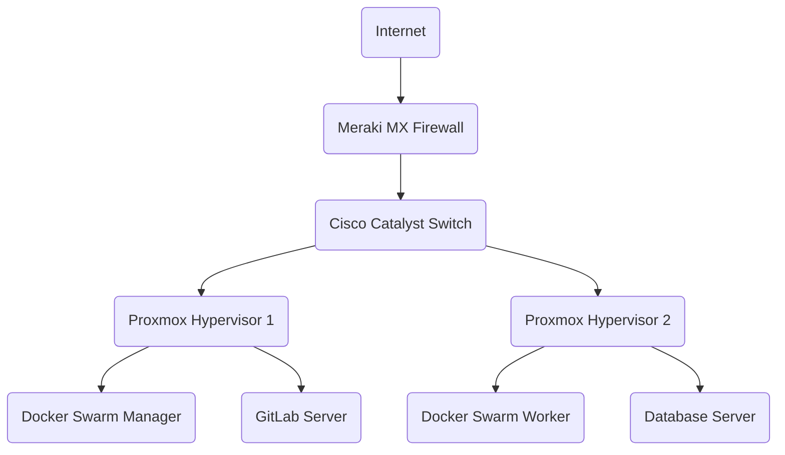
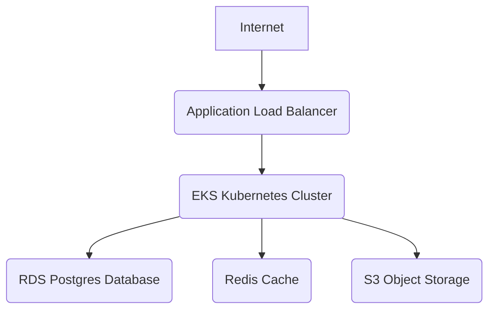
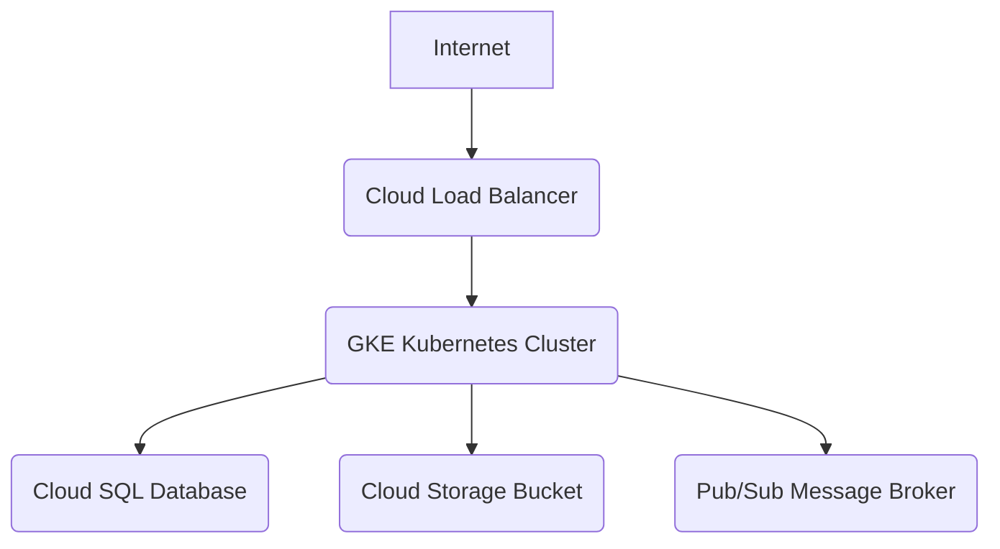

# Architecture Diagrams

This document maps out the standard personal homelab architecture as well as primary Cloud Architectures (AWS/GCP).

## Homelab Architecture

## AWS Cloud Architecture

## GCP Cloud Architecture

