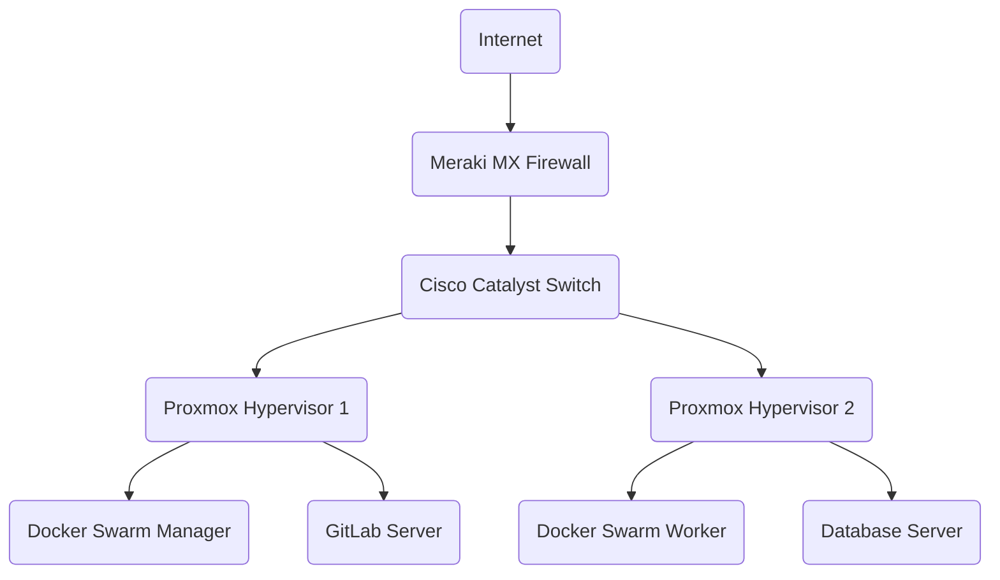

# Homelab Architecture Diagram

This diagram maps out the standard personal homelab architecture, including edge routing, core switching, and virtualization layers.

```mermaid
graph TD;
    WAN(Internet) --> EdgeRouter(Meraki MX Firewall);
    EdgeRouter --> CoreSwitch(Cisco Catalyst Switch);
    CoreSwitch --> Server1(Proxmox Hypervisor 1);
    CoreSwitch --> Server2(Proxmox Hypervisor 2);
    Server1 --> VM1(Docker Swarm Manager);
    Server1 --> VM2(GitLab Server);
    Server2 --> VM3(Docker Swarm Worker);
    Server2 --> VM4(Database Server);
```
